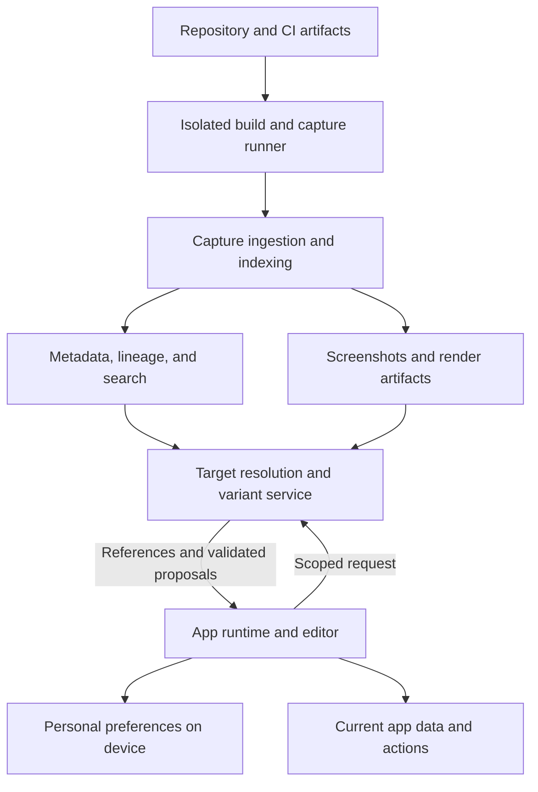

# UI Intelligence — Engineering Architecture v0.2

September 23, 2026 · Integrated first-release design

This design is grounded in your attached conversation and handwritten sketch. Your stated requirements are preserved below; implementation choices are recommendations, not decisions you previously approved. The contracts are design examples, not an implemented or benchmarked SDK.

Revision 0.2 incorporates our decision to pursue a substantial, connected first implementation. Runtime personalization, page composition, historical capture, identity, screenshot/text resolution, generation, and backend services belong to one first release, called **R1** below. Verification checkpoints establish whether those parts work together. The carousel example is one acceptance case within that release.

Changes from revision 0.1: page composition and scoped batches enter R1; binding and state-transfer contracts become explicit; the monorepo and module interfaces are specified; integrated user journeys and release criteria replace the small sequential prototype plan. The identity model, evidence labels, isolation boundaries, and local preference model remain the foundation.

The product lets someone point to an interface, describe a change or supply a reference, inspect alternatives, and apply a personal presentation while the application continues to supply its current data and behavior. Historical UI is one reference source alongside screenshots, text, and newly generated designs. The same addressing model must support a button, a repeated card, a section, a page, and a collection of pages.

The central engineering contract is:

**A presentation may change only within the data, actions, state, and constraints that the current application exposes for that scope.**

## 1. Requirements and working assumptions

| Requirement from your conversation | Architectural consequence |
| --- | --- |
| Preferences live and take effect on the client | Browser runtime, local persistence, cached validated variants, undo; optional device sync |
| Users select by clicking, text, or screenshot | One target-resolution API with different evidence inputs |
| References can be old UI, an external design, or an original idea | Retrieval and generation remain distinct; every preview records its origin |
| Show roughly four or five alternatives | Default to four useful candidates; distinguish recorded history from generated adaptations; return fewer when fewer exist |
| Any hierarchy level can change; a carousel can become a grid or table | Semantic targets, hierarchical scopes, replaceable representation boundaries, required data/action bindings |
| Select a historical window and extend it later | Persistent scan plans, bounded backfill, reusable captures, explicit coverage gaps |
| Track continuously during builds | CI capture integration; expensive history processing runs asynchronously |
| Eventually support many web frameworks and native apps | Shared metadata and transformation contracts, adapter-specific capture and rendering capabilities |
| Keep integration fast and secure | Small production runtime; isolated execution of repository code; source and history access separate from end-user access |

Working assumptions: the first adopter is an application developer who can install an SDK in an app they control. The everyday consumer is that app's end user. R1 covers one integrated React + Vite web application with multiple routes, registered components, and replaceable page layouts. Framework choice remains a proposed implementation default. Next.js, other web frameworks, and native platforms follow evidence from this implementation. A browser extension for unrelated websites is a separate later delivery mode with weaker guarantees.

No workload, team size, cloud provider, customer repository, or deployment budget was supplied. Capacity figures below are explicit examples and proposed test budgets.

## 2. Decisions that shape the system

| Decision | Reason and consequence |
| --- | --- |
| Separate observation from executable transformation | We can record or discuss more UI than we can safely transform automatically |
| Use durable IDs plus versioned evidence | Content hashes identify bytes; they cannot establish semantic continuity through a redesign |
| Register app capabilities explicitly | A screenshot, source map, or function name cannot reliably establish a callable business contract |
| Apply live structural changes through the framework | React warns that externally changing managed DOM children can cause inconsistent rendering or crashes [1] |
| Keep personal changes separate from product changes | A local preference uses the runtime; a product change uses a source branch, review, and the app's deployment process |
| Preserve original observations and label reconstructions | Today's reconstruction of an old commit is evidence from today, not proof of exactly what a user saw years ago |
| Start with a modular backend and separate workers | Clear ownership without premature distributed-service overhead; untrusted build execution still needs a real isolation boundary |
| Make uncertainty visible | Ambiguous identity, unsupported bindings, missing history, and incomplete capture are valid results |
| Deliver the first system as an integrated release | Build against shared contracts across runtime, history, agent, and backend; use execution evidence to catch incorrect assumptions throughout implementation |

The most important limitation: a universal schema does not make arbitrary application rewrites automatic. Integration depth determines what is possible. Full-page transformations also introduce state, navigation, focus, and workflow concerns that a single-button change does not have.

## 3. High-level architecture



One backend deployment initially contains project configuration, capture ingestion, lineage, retrieval, and proposal orchestration as modules. PostgreSQL stores relational metadata and initially handles vector search through pgvector. Private object storage holds large artifacts. A durable PostgreSQL job table is sufficient for the initial worker queue.

Separate processes perform indexing and rendering. Repository builds run in disposable customer CI jobs first. A managed build service, if introduced, requires tenant-isolated execution environments and its own credentials and network policy; moving build execution out of the API process alone is insufficient isolation.

| Package or process | Owns |
| --- | --- |
| `@ui-intelligence/protocol` | Versioned schemas, identifiers, errors, adapter declarations |
| Runtime core and preference store | Framework-neutral scope planning, conflict checks, local revisions, recovery |
| `@ui-intelligence/react` | Semantic boundaries, current instance registry, supported renderers, selection, preference application |
| Renderer registry | Approved component representations, recursive layouts, property schemas, preview action stubs |
| `@ui-intelligence/vite` | Private source manifest, build identity, optional source instrumentation |
| `@ui-intelligence/cli` | Project configuration, scan planning, capture execution, CI artifact upload |
| Editor and history console | In-app selection and previews; developer-facing history, coverage, and source inspection |
| API service | Authorization, projects, captures, retrieval, proposal records |
| Index worker | Capture processing, comparisons, embeddings, lineage candidates |
| Capture runner | Repository builds, scenario execution, screenshots and metadata |

These are proposed package names. The app continues to use its existing hosting and backend.

Use one repository with separately buildable packages. Version shared schemas centrally; generate or validate TypeScript types against those schemas. Modules exchange documented values and artifact references rather than importing one another's database tables. The public runtime manifest advertises protocol versions, renderer versions, and supported features. An unsupported required feature produces a compatibility error and preserves the canonical interface.

Keep ordinary use of the host app independent of platform availability. The runtime and cached compatible preferences execute locally; the API, database, object store, and index worker serve new history and generation requests. Model credentials, repository credentials, and private source manifests stay outside the production browser bundle.

## 4. The identity model

Do not collapse component definition, semantic purpose, current instance, and historical screenshot into one ID.

| Object | Meaning | Example |
| --- | --- | --- |
| `UiEntity` | Durable semantic identity within a project | The product chooser on the catalog page |
| `UiEntityVersion` | That entity's known representation and contract at a build | Carousel at build A; grid at build B |
| `UiOccurrence` | A concrete observation in one capture | Product chooser in the desktop, signed-in, populated scenario |
| `RuntimeInstance` | One currently mounted occurrence | The chooser currently visible in this browser tab |
| `SourceDefinition` | Source symbol or style/token definition at a commit | `ProductCarousel`, shared `Button`, spacing token |
| `Capability` | A versioned app operation or data binding | `catalog.products@1`, `product.open@1`, `cart.add@1` |
| `Artifact` | Immutable stored bytes | Screenshot, sanitized DOM package, source manifest |

One source definition may produce many semantic entities and instances. One visible result can be influenced by multiple source definitions, styles, tokens, and dependencies. Model source provenance as a set of links with an evidence kind; a source link does not prove that file caused a visual change.

Allocate opaque entity IDs. Developers may attach a stable project-scoped key such as `catalog.productChooser`; enforce uniqueness and keep explicit aliases for deliberate renames. A key collision is a configuration error, not grounds to merge entities. Use hashes for immutable artifacts and normalized version fingerprints, within an authorization scope.

Store containment on observed/versioned graphs, not as one permanent parent field on the entity. A component can move. Repeated instances need distinct occurrence IDs. Instance-specific preferences require a developer-declared stable, non-sensitive instance key; a temporary DOM selector or array position is insufficient.

Lineage supports `continues_as`, `split_into`, `merged_into`, and `replaces`, with evidence and review status. A split or merge normally introduces new entities. Sharing a capability is evidence of related purpose, not proof of shared identity.

For previously uninstrumented history, inferred continuity remains provisional. Unresolved observations stay queryable without receiving a falsely certain entity assignment.

## 5. Capture contracts and evidence

An application does not have one appearance per commit. Capture is defined by both build and scenario.

```typescript
type CaptureSpec = {
  protocolVersion: 1;
  projectId: string;
  commitSha: string;
  buildArtifactDigest: string;
  scenario: {
    id: string;
    recipeDigest: string;
    route: string;
    fixtureDigest: string;
    role: string;
    featureFlagsDigest: string;
    viewport: { width: number; height: number; deviceScaleFactor: number };
    locale: string;
    timeZone: string;
    colorScheme: "light" | "dark";
    reducedMotion: boolean;
  };
  environment: {
    runnerImageDigest: string;
    browserRevision: string;
    fontsDigest: string;
    adapterVersion: string;
    captureToolVersion: string;
    redactionPolicyDigest: string;
  };
};

type Observation = {
  occurrenceId: string;
  captureId: string;
  parentOccurrenceId?: string;
  entityVersionId?: string;
  explicitAnchor?: string;
  role?: string;
  visibleText?: string; // already sanitized
  bounds: Array<{ x: number; y: number; width: number; height: number }>;
  coordinateSpace: "document-css-pixels";
  sourceLinks: Array<{
    definitionId: string;
    evidence: "registered" | "instrumented" | "inferred";
  }>;
  screenshotArtifactId?: string;
  domArtifactId?: string;
  completeness: "complete-for-scenario" | "partial";
  limitations: string[];
};
```

Capture manifests additionally record timestamps, Git parents, artifact references, fixture substitutions, masks, scroll offsets, crop transforms, and build failures. Full-page and region screenshots may need different coordinate transforms; store those explicitly rather than guessing from pixel dimensions.

The scenario recipe prepares fixtures, navigates, performs named interactions, waits for an app readiness signal and fonts/assets, then captures. Record frozen clocks or random seeds when used. Two stable frames are useful evidence of readiness, but do not prove the app has reached every intended state. Playwright documents environmental variation in screenshots, so baseline and comparison environments must be controlled [2].

| Evidence label | What the system may claim |
| --- | --- |
| `captured_at_build` | Observed at that build in the recorded scenario |
| `reconstructed_from_commit` | Rendered later from that source; substitutions and environment recorded |
| `replayed_artifact` | Displayed from preserved visual artifacts; interactive fidelity not implied |
| `source_only` | Source evidence exists; no observed appearance is available |
| `unavailable` | The requested build or scenario could not be recovered |

Preserve screenshots as the visual record. An optional sanitized DOM/CSS/asset package supports inspection and approximate replay. Missing fonts, canvas output, media, shadow roots, and external assets can reduce replay fidelity. Captured HTML does not preserve JavaScript closures, framework state, or business behavior.

Historical replay is inert by default, on an isolated preview origin with scripts and network disabled. Active adaptation is rendered separately through today's approved renderer and data contracts.

## 6. Runtime and framework integration

The first React adapter uses explicit semantic boundaries, context, and host-node refs. A boundary registers its entity key, supported presentations, data/action contracts, state adapter, and one or more DOM roots. The runtime maintains a `WeakMap` from host nodes to instances and a separate logical containment graph. Ref registration must clean up correctly during unmounts, development remounts, and hot updates.

Selection walks the event's composed path, resolves the nearest registered instance, and lets the user expand to logical ancestors. Portals follow registered logical ownership. Fragment roots can map to several bounds. Virtualized content is described as partially observed; absent offscreen rows are not assumed to have disappeared from the app.

The Vite plugin emits a private source manifest with commit, file, symbol, span, and instrumentation version. Vite provides transform hooks and virtual modules suitable for this build integration [3]. A separate public manifest exposes only permitted entity keys and runtime contracts. Source maps and AST analysis supplement registration; neither automatically yields complete DOM-to-business-semantics mapping.

Do not make private framework internals the production contract. Automatic host-node annotation can improve observation later, but complete transformation authority still comes from registered boundaries.

Proposed registration shape:

```typescript
const productChooserContract = {
  entityKey: "catalog.productChooser",
  contractVersion: 1,
  dataBinding: "catalog.products@1",
  allowedRepresentations: ["carousel@1", "grid@1", "table@1"],
  actions: ["product.open@1", "cart.add@1"],
  requiredFields: ["product.id", "product.name", "product.price"],
  stateFields: ["selectedProductId", "sortOrder", "filters"],
  constraints: {
    preserveActions: true,
    preservePriceVisibility: true,
    maximumColumns: 4
  }
};
```

The developer supplies the actual data provider, action functions, and state handling in trusted app code. The manifest contains references, not serialized executable functions. No agent infers permission to invoke an action from its name.

The in-process binding interface needs lifecycle and concurrency semantics, not just a list of names:

```typescript
type JsonValue =
  | null | boolean | number | string
  | JsonValue[] | { [key: string]: JsonValue };
type ContractRef = { id: string; version: number; schemaDigest: string };
type DataSnapshot = {
  revision: string;
  status: "loading" | "ready" | "error";
  value: JsonValue;
};
type DataBinding = {
  contract: ContractRef;
  getSnapshot(): DataSnapshot;
  subscribe(onChange: () => void): () => void;
};
type ActionResult =
  | { status: "succeeded"; value: JsonValue }
  | { status: "rejected"; code: "denied" | "invalid_input" | "stale_data" }
  | { status: "failed"; retryable: boolean };
type ActionBinding = {
  contract: ContractRef;
  invoke(
    input: JsonValue,
    context: { invocationId: string; dataRevision?: string; signal: AbortSignal }
  ): Promise<ActionResult>;
};
type StateAdapter = {
  version: number;
  canSwitch(): { allowed: true } | { allowed: false; reason: string };
  exportState(): JsonValue;
  validateState(state: JsonValue, destinationRenderer: string): boolean;
  importState(state: JsonValue): void;
};
```

These functions live in trusted host code. Only their contract descriptions and explicitly permitted data enter agent requests. Serialized references use an ID and version, such as `catalog.products@1`, resolved against the current host registry. Schema digests prevent a silently changed schema from passing under an unchanged version.

A data binding exposes a consistent snapshot and notifies subscribers when its revision changes. The new renderer continues subscribing to current data after application; it does not freeze the products or prices from a historical screenshot. Actions receive schema-validated arguments drawn from allowed inputs and current bindings. User identity and business authorization come from the existing host session and backend. The agent cannot supply an authoritative identity.

Invocation IDs support tracing and, where the host operation supports it, idempotency. The SDK must not blindly retry mutations. Preview environments install stub action bindings and controlled data providers. Tests use synthetic fixtures; personal previews may use an authorized read-only snapshot of current app data. Neither receives live mutation implementations. Current-data previews remain local unless the user explicitly sends that permitted data for a remote operation. Generating or accepting a layout invokes no business action.

Each switch first asks the source state adapter whether it can proceed, exports declared state, validates the destination, and preserves the previous state until commit. Focus is recorded using a semantic target key with a registered fallback. Side effects and business transactions remain outside layout rollback. A failed asynchronous action is not repaired by pretending a UI rollback reversed it.

For a carousel-to-grid change, the SDK selects the grid renderer and supplies the current product data and bindings. It transfers declared view state, restores focus where possible, and preserves pending application mutations. Unregistered internal component state cannot be migrated reliably; if state cannot transfer, request an explicit reset or defer the switch until safe. Navigation and unsaved forms require declared preservation rules.

For server-rendered frameworks later, keep the initial client tree consistent with server output, then apply local structural preferences after hydration. React requires that initial match [4]. This may cause a visible layout transition; eliminating it requires a deliberate server-known preference or client-owned region design.

## 7. Executable UI proposals

Use two distinct representations:

1. **Observed UI graph:** permissive, partial, descriptive evidence from arbitrary interfaces.
2. **Executable presentation specification:** validated composition of approved types, bindings, tokens, and actions.

A screenshot or historical observation is not automatically an executable specification. An adaptation step maps it to current capabilities and reports anything unsupported.

R1 renders both registered component representations and recursive page layouts. Every type has a versioned property schema and allowed children; adding arbitrary nodes to the JSON cannot add executable power. Start with approved stack, grid, and split layouts plus registered region slots. The app owns navigation and route definitions; changing page composition does not implicitly change routing or business workflows.

```json
{
  "schemaVersion": 1,
  "proposalId": "proposal_example",
  "target": {
    "entityId": "entity_product_chooser",
    "entityVersionId": "entity_version_current",
    "scope": "entity",
    "lockedEntityIds": []
  },
  "preconditions": {
    "appBuildId": "build_current",
    "contractDigest": "contract_digest_current",
    "policyVersion": 1,
    "preferenceRevision": 7
  },
  "presentation": {
    "type": "grid@1",
    "properties": { "columns": 3, "density": "compact" },
    "dataBinding": "catalog.products@1",
    "actions": ["product.open@1", "cart.add@1"]
  },
  "origin": { "kind": "generated", "referenceIds": [] }
}
```

This proposal contains no arbitrary JavaScript, event-handler strings, URLs, CSS expressions, or backend credentials. The runtime verifies property ranges, supported types, binding versions, required content, locked regions, and target scope. Semantic invariants and accessibility checks are additional gates, not guarantees obtained merely by validating JSON.

Page composition uses the same proposal envelope, with a layout tree as its presentation. A minimal tree contract is:

```typescript
type LayoutNode =
  | {
      kind: "layout";
      nodeId: string;
      type: "stack@1" | "grid@1" | "split@1";
      properties: Record<string, JsonValue>;
      children: LayoutNode[];
    }
  | {
      kind: "region";
      nodeId: string;
      slotId: string;
      entityId: string;
      representationId?: string;
    };
```

Each page contract declares required, optional, locked, and repeatable slots, compatible renderers, and permitted nesting. Validate slot membership, unique node IDs, allowed child types, bounds on depth/node count, and representation compatibility. Required slots occur exactly once unless the contract explicitly allows repetition. References cannot introduce an entity from a different scope or project. Locked slots preserve their registered content and declared position constraints.

R1 page editing supports moving registered regions within allowed layouts, choosing compatible region representations, adjusting approved tokens, and preserving required regions. State belongs in stable host stores or declared adapters when a move would remount a region. If an app's state contract cannot support a move, the affected layout is ineligible until the integration supplies one.

For hierarchical edits, materialize the affected target set and its base versions into the proposal. A one-time request to change all buttons affects that resolved set; it is not silently converted into a rule governing all future buttons. R1 supports exact entity, declared instance, registered page, and explicit batches across registered pages. Persistent semantic rules that automatically affect future UI are an extension.

Overlapping proposals use optimistic concurrency and explicit conflicts. A parent replacement preserves required semantic slots and excludes locked descendants. If this cannot be proven by the registered contract, the proposal is not eligible for live application. R1 supports site-wide changes over a finite declared set of compatible targets. Arbitrary recomposition of unregistered application internals remains outside that guarantee.

A batch proposal carries a read set of every target's entity version, contract digest, and preference revision. Validation runs for the whole set. A single local preference transaction activates the batch's new revision; active regions render through their adapters and other routes apply it when mounted. This is atomic preference activation, not a claim that separate browser tabs or unmounted pages paint simultaneously. Each mounting route revalidates compatibility. On failure in the current application operation, restore the prior preference revision and show which target failed.

## 8. Request-to-application flow

1. **Resolve.** A click provides instance and entity references directly. Text and screenshots retrieve candidates. If ambiguous, highlight candidates for the user to choose before generating a patch.
2. **Ground.** Load the current permitted contract and authorized history; record build, contract, and preference revisions.
3. **Generate.** Ask the model for candidate specifications within that contract. Historical lookup returns genuine captures separately from adaptations. Prefer four diverse candidates, not four cosmetically different duplicates.
4. **Validate.** Parse the specification, enforce scope and bindings, then render in a preview using controlled data and stub actions. Check layout, required content, keyboard behavior, and selected business invariants.
5. **Preview.** Show which candidates are recorded history, adapted history, or newly generated. A generated image is a concept preview; only an actual renderer output is an interactive preview.
6. **Accept.** Store the user's selection and the exact specification digest. Preview actions cannot charge, submit, or modify live records.
7. **Revalidate and apply.** Check current revisions again, persist a recoverable preference transaction, and ask the framework adapter to render the accepted presentation.
8. **Observe and undo.** On a render failure, restore the prior preference and canonical renderer. Application action failures remain handled by the host app. Keep an independent reset control outside replaceable regions.

Keep target evidence separate from design references in the request protocol:

```typescript
type TargetQuery =
  | { kind: "selection"; entityId: string; runtimeInstanceId: string }
  | { kind: "text"; text: string }
  | { kind: "screenshot"; artifactId: string; cropId?: string };
type DesignReference =
  | { kind: "history"; captureId: string; occurrenceId?: string }
  | { kind: "image"; artifactId: string }
  | { kind: "text"; text: string };
type UiRequest = {
  requestId: string;
  operation: "show_history" | "compare" | "propose_change";
  target: TargetQuery;
  references: DesignReference[];
  instruction: string;
  appBuildId: string;
  requestedCandidateCount: number; // bounded by project policy
};
```

For “make this section like that screenshot,” the current selection is the target and the screenshot is a reference. For “which component is this screenshot showing?”, the screenshot is target evidence. Store the distinction so a reference from an unrelated app cannot silently become a target identity. The service verifies every referenced artifact against the caller's permissions.

Proposal processing uses `queued`, `resolving`, `needs_selection`, `generating`, `validating`, and `ready`, with terminal `failed` and `cancelled` states. Acceptance creates a separate event for a specific immutable candidate digest. Local application has its own pending/active/reverted lifecycle; server acceptance alone does not prove the browser applied anything. If the resolved target, contract, or candidate changes, previous acceptance does not carry over.

The model receives bounded context: the user's instruction, permitted target contract, relevant sanitized evidence, and supported renderer schemas. The orchestrator enforces token/time/candidate budgets and may attempt at most two schema-repair rounds by default. Every repair preserves the same target scope and policy; exceeding the budget returns a structured failure. Model/provider metadata, prompt-template version, and validation results belong in the proposal record for diagnosis. Provider selection is configurable, and validation does not trust the provider's claim of correctness.

Model output, OCR text, source comments, and repository content are untrusted inputs. They cannot change project authorization or grant new capabilities. The model proposes; deterministic runtime and server checks decide eligibility. Existing server-side authorization remains necessary for every business action.

If a desired design needs an unregistered component or changed business flow, create an exploratory preview and surface the missing contract to developer mode. R1 developer mode includes source/history inspection and export of an accepted declarative specification for integration into app-owned configuration. A later source-editing module can create repository patches, execute the app's checks, and produce reviewable diffs. Restoring old visuals must not silently restore old backend logic. Merging and deploying follow the application's normal process.

## 9. Local preference persistence

Use IndexedDB for structured preferences and a bounded preview cache. Namespace by application origin, project, and an opaque host-provided user/profile ID so one account's preferences do not apply to another. Never use that local ID as backend authorization.

| Local store | Key and contents |
| --- | --- |
| `preferences` | Profile + scope key; active specification digest, revision, contract version |
| `specifications` | Digest; immutable validated proposal and required renderer versions |
| `applications` | Application ID; previous and proposed preference, pending/active/reverted status |
| `previewCache` | Artifact ID; bounded disposable previews |
| `syncOutbox` | Optional sync operations with unique operation ID and base revision |

Application protocol: in one IndexedDB transaction, record the pending change, its complete target read set, and previous active version. Render the candidate. On a successful adapter commit, finalize the active preference transaction; on failure, restore the previous version. At startup, incomplete applications recover to the previous confirmed version. If persistence fails, offer a session-only change and accurately report that it was not saved. Batch application records every participating preference under one application ID so undo restores the full set.

Finalization, rollback, and undo compare expected revisions inside their transactions. If another operation has already changed a target, return a conflict rather than overwriting its newer preference. UI effects outside the local preference transaction are reconciled from the resulting confirmed revision.

Use revision checks for competing tabs and notify other tabs after a commit. On account switching, change namespaces and clear in-memory selections and sensitive cached context. Precedence is deterministic: app defaults, organization settings, then personal overrides within the owner's allowed policy; within personal scope, app, page, entity, then stable instance. Mandatory constraints always remain enforceable.

Applying an already cached, compatible variant can work without the AI service. Fresh generation and uncached historical retrieval require connectivity in the initial design. Browser data can be evicted and persistence requests can be denied, so provide export/import and optional sync rather than promising permanent local retention [5].

On a new app release, revalidate saved preferences against the contract. Explicit migrations may upgrade them. An incompatible preference is retained as a recoverable draft while the default interface renders. R1 implements local export/import and competing-tab conflict handling. Cloud sync remains an optional protocol extension; its future implementation uses revision-based conflicts, with conflicting layouts never silently merged.

## 10. Historical onboarding and continuous indexing

Persist a `HistoryPlan`: selected repository and branches, resolved tip SHAs, requested time window, timezone, scenarios, maximum builds, render budget, execution mode, and retention settings. Relative choices such as “six months” resolve to explicit dates when the scan is created. Commit dates are filter inputs, not evidence of deployment dates.

The first CLI flow is `init`, `history plan`, `history run`, and `capture`. The proposed commands are interface design, not available software.

Planning and execution:

1. Inventory reachable commits, releases, available CI artifacts, and existing captures without executing repository code.
2. Resolve a concrete immutable scan plan. Prefer relevant existing artifacts and explicit releases; select other candidate commits using diff, dependency, token, asset, and configuration signals.
3. Estimate an upper bound and uncertainty range from a small pilot; enforce user/project budgets throughout execution.
4. Run selected build and scenario jobs in isolation. Historical dependency/environment failures are recorded, not automatically repaired into an apparently authentic past build.
5. Ingest manifests, verify artifact digests and permissions, then commit metadata and an indexing job atomically.
6. Build candidate lineage, visual differences, text/image indexes, and coverage summaries. Reuse already successful compatible captures when the window expands.

Record the Git parent DAG. Explicitly choose comparison semantics: parent/merge-base for a code review, previous deployed artifact for release history, or chosen baseline for a visual comparison. A chronological timestamp sort is not sufficient for branches and merges.

Do not binary-search visual changes as though appearance were monotonic. A UI can change from A to B and back to A inside an interval. Sampling can miss B. Use release checkpoints, budgeted periodic samples, candidate commits, and request-driven refinement. State “first observed in this capture” unless coverage actually establishes the introducing commit.

Initially, capture all declared scenarios for a selected build. Add selective rendering only after measuring impact-prediction recall. Global styles, tokens, dependencies, assets, and configuration can affect many routes; uncertainty triggers a broader capture. Track skipped scenarios as skipped, not unchanged.

Continuous capture is a side job following a usable app build. It reuses that build when possible. Indexing, embedding generation, and backfill do not sit on the release critical path unless the app owner later chooses a blocking gate. Build-time manifest generation still has measurable overhead and must be budgeted.

## 11. Job execution and recovery

Create a capture request key from a canonical serialization of project scope, immutable build identity, full scenario, environment, adapter, and redaction policy. Dependencies and build configuration must be reflected in the immutable build identity. Credentials never enter the key.

The request key deduplicates equivalent work. An execution attempt has a separate ID. A forced rerun records a new observation instead of overwriting the prior capture or implying the output must be deterministic.

Jobs progress through `queued`, `running`, and a terminal state: `succeeded`, `failed`, or `cancelled`. Execution stage is a separate field, such as `building`, `capturing`, or `indexing`. Retryable failures return to the queue with a bounded attempt count and backoff.

A worker claims a queued job in a short database transaction, assigns a lease token and expiry, then releases the transaction before doing work. It renews the lease with heartbeats. Only the current token can finalize results. A lost worker's lease expires and another worker can retry; staged artifacts are immutable and metadata publication is idempotent. Delivery is at least once, not assumed exactly once.

Upload artifacts to a staging namespace first. Publish the capture only after required objects and checksums are verified. An outbox entry in the same metadata transaction schedules downstream indexing. Garbage collection removes unreferenced staging objects after a grace period. Failed embeddings leave captures available for browsing and lexical search.

Cancellation stops scheduling new work, signals active work, and enforces a termination deadline. Resource limits include build time, capture count, network, disk, memory, model calls, and artifact bytes.

## 12. Storage model and service interfaces

All project records carry `tenant_id` and `project_id`. Use composite uniqueness and foreign keys to prevent accidental cross-project associations. Authorization is derived from the authenticated principal, not a tenant ID supplied in a request body.

| Table | Principal fields and constraints |
| --- | --- |
| `projects` | Repository reference, settings, policy revision |
| `history_plans` | Window, branch tips, scenario set, budgets, status |
| `commits`, `commit_parents` | Unique repository + SHA; ordered parent links |
| `builds` | Commit, artifact digest, recipe/environment identities, outcome |
| `scenarios` | Stable name plus versioned recipe digest |
| `capture_requests`, `capture_attempts` | Unique request key; execution IDs, provenance, outcomes |
| `captures` | Successful observation manifest and evidence label |
| `ui_entities` | Opaque ID; optional unique developer key within project |
| `entity_versions` | Entity + build + contract + representation fingerprint |
| `occurrences` | Capture-local identity, parent, version link, geometry, completeness |
| `source_definitions`, `source_links` | Commit-specific symbols and many-to-many provenance |
| `lineage_edges` | Relation, evidence, candidate score, review state, matcher version |
| `artifacts` | Scoped object key, digest, MIME type, size, visibility, retention |
| `embedding_spaces`, `embeddings` | Model/version/dimension/modality plus artifact reference |
| `proposals`, `variants` | Inputs, grounded target, exact specification, validation evidence |
| `preference_revisions` | Optional synchronized profile preferences and base revisions |
| `jobs`, `outbox` | Work state, leases, deduplication, attempts |

Containment references must point within a capture and pass cycle validation. Lineage edges must stay in-project and respect the declared relation semantics. Historical metadata is append-oriented; corrected identity assignments are auditable revisions rather than destructive rewrites of captured pixels.

Core indexes: entity history by entity and build; occurrences by capture; captures by project/build/scenario; source definitions by commit/path/symbol; pending jobs by status/availability; variants by authorized target and origin. Start with relational queries and full-text search. Introduce vector indexes after measuring corpus size, latency, and retrieval quality.

PostgreSQL row policies can add isolation, but superuser/BYPASSRLS roles and normally table owners bypass them. Runtime queries must use a suitable restricted role; test the actual deployment role [6]. Object storage retrieval needs its own authorization checks and short-lived scoped access. Public and end-user manifests never confer access to private source artifacts.

| API | Purpose and key response behavior |
| --- | --- |
| `POST /v1/projects/{p}/history-plans` | Persist resolved window/budgets and return plan/estimate |
| `POST /v1/projects/{p}/history-plans/{id}/runs` | Start immutable plan; return `202` and job ID |
| `POST /v1/projects/{p}/artifact-uploads` | Allocate project/user-scoped upload slots with size, media type, and digest constraints |
| `POST /v1/projects/{p}/captures` | Validate manifest and finalize uploaded artifacts; idempotency key required |
| `GET /v1/projects/{p}/runtime-manifest` | Return the permitted build manifest and protocol/renderer capabilities |
| `POST /v1/projects/{p}/resolve` | Resolve authorized text/image/instance evidence to candidates with explanations |
| `GET /v1/projects/{p}/entities/{id}/history` | Paginated observations with provenance and coverage gaps |
| `POST /v1/projects/{p}/proposals` | Create bounded generation request against current revisions |
| `GET /v1/projects/{p}/proposals/{id}` | Return progress, candidates, validation, and missing requirements |
| `POST /v1/projects/{p}/proposals/{id}/accept` | Record accepted candidate and digest; does not execute business actions |
| `POST /v1/projects/{p}/proposals/{id}/export` | Export the accepted declarative specification for app-owned configuration |
| `GET /v1/projects/{p}/jobs/{id}` | Return durable stage, progress, coverage, and retry/failure details |
| `POST /v1/projects/{p}/jobs/{id}/cancel` | Request cancellation under the owning project's permissions |
| `PUT /v1/projects/{p}/preferences/{key}` | Reserved optional sync extension with `If-Match` revision; outside R1 |

Runtime methods `preview`, `apply`, `undo`, and `reset` work locally. Remote acceptance recording is optional for an already validated cached personal variant. Apply always enforces the current host contract.

Use `409` for stale revisions, `422` for unsupported/invalid specifications, and structured unresolved-target responses for ambiguity. Long jobs expose progress polling initially. Idempotency replay with a different payload is rejected. Every response includes a trace ID; lists use stable cursor pagination.

Artifact upload slots expire, accept only allowed media types, and enforce byte/pixel limits. Completion verifies the object's digest and expected ownership before another record can reference it. Capture ingestion verifies all required objects before publication; it never dereferences arbitrary user-supplied remote URLs. Screenshot/reference uploads are explicit user actions, separate from automated capture of synthetic scenarios.

## 13. Target resolution, lineage, and retrieval

Direct selection is the highest-quality target input. A screenshot of this app requires visual grounding. An external reference screenshot is a style/layout reference and should not be forced into the app's identity graph.

For screenshot grounding, begin with the caller's authorized project, build, route, and scenario if known. Extract visible text and layout cues, retrieve image/text candidates, and compare candidate crops with surrounding structure. Account for resizing, cropping, device scale, scrolling, theme, and personal overrides. When resolution is weak, show the user a shortlist or ask them to select the current region.

Combine lexical ranking, visual retrieval, source history, context, and structural evidence. A weighted similarity score is not a calibrated probability; do not display invented “92% certain” labels. Evaluate on a labeled dataset, establish thresholds, and preserve the option to abstain. A false match that applies a change to the wrong target is more costly than asking for selection.

Lineage candidate generation starts with explicit keys and reviewed aliases, then considers source continuity, neighboring/parent context, role/text, structure, and appearance. Competing matches must be considered together; a greedy nearest-neighbor pass can map several unrelated nodes to one predecessor. Split/merge candidates are explicit relations, not accidental one-to-one matches.

Store image, text, and optional code embeddings with their model ID, version, dimension, and preprocessing digest. Compare only compatible spaces. Text-to-image similarity is valid only for a model designed to align those modalities. Otherwise combine independent ranked results. Raw source/code embeddings remain restricted to developer-authorized queries.

Apply authorization constraints in every search path. For the initial small corpus, use exact search over the permitted subset. With approximate vector indexes, filtered queries may return too few results; pgvector documents this behavior and available scanning/indexing approaches [7]. Measure recall before adopting a shared approximate index.

For historical alternatives, group near-duplicate captures but retain the underlying evidence. Select distinct designs compatible with the requested scope and explain gaps. Grouping is a presentation optimization, not deletion of intermediate history. Visual similarity does not establish equivalent behavior.

## 14. Trust boundaries and operational behavior

The most sensitive inputs are repository execution, proprietary source, authenticated UI captures, and callable business actions.

Run builds with the minimum project-scoped credentials, synthetic/test data, no production secrets, and no host-control sockets. Untrusted pull requests must not inherit trusted-branch credentials. Treat package installation and build scripts as executable code. Any permitted network access is explicit, including dependency registries; isolated workers cannot freely reach internal services or cloud metadata endpoints.

Redact before screenshots, DOM serialization, logs, and embeddings leave the capture environment. Masked pixels alone do not remove the same secret from DOM text or accessibility metadata. Redaction policy version is part of capture provenance. A model sees only data permitted for that user and task. Prompt text from an app or repository is never promoted to an instruction authorizing tools.

Keep separate access classes for public runtime contracts, user-visible historical previews, team metadata, and private source evidence. The app owner chooses which historical artifacts end users may inspect. Retention and deletion cover derived embeddings and previews as well as originals; reference-aware garbage collection preserves artifacts still referenced by allowed records, subject to explicit deletion policy.

| Failure | User-visible result and recovery |
| --- | --- |
| AI service unavailable | Existing app and compatible saved preferences still render |
| History build fails | Show source-only or unavailable evidence with a reason |
| Target ambiguous | Highlight candidates; no automatic application |
| Contract changes before apply | Mark candidate stale and regenerate or use a validated migration |
| Personal renderer fails | Restore previous/canonical presentation; retain undo/reset access |
| Browser storage unavailable | Session-only operation; state clearly that persistence failed |
| Worker disappears | Lease expires; bounded retry with deduplicated publication |
| Embedding generation fails | Browse and lexical search remain usable; retry indexing |

Record operational metrics by project and stage: capture success, unrenderable history reasons, costs, index lag, resolution abstention, verified match precision, preview rejection, apply failures, and rollback frequency. Avoid recording sensitive page text in telemetry by default.

## 15. Performance and cost model

For a selected workload:

`capture_count = builds × routes × states × viewports × other declared variants`

Example assumptions: 20 builds × 10 routes × 3 states × 2 viewports = **1,200 captures**. At an assumed average of 2 MB of retained visual/DOM artifacts each, that is approximately **2.4 GB**, excluding build artifacts, replicas, source indexes, and retention overhead. At 8 seconds per capture, raw capture time is **2.67 worker-hours**, before build, setup, retries, and indexing. Ten perfectly utilized capture workers would reduce that portion to about 16 minutes; real elapsed time will be higher.

Estimate from a pilot rather than quoting this as product performance. Rendering history can dominate cost. Reuse build artifacts, bound scenario matrices, deduplicate immutable assets, batch metadata, and schedule backfills below interactive workloads. Deduplication stays within authorized storage boundaries.

Initial measurement goals, not promises: under 30 KB gzip for the inactive core runtime excluding editor/model assets; no network requirement to apply a cached variant; under 100 ms p95 local switch time for the representative fixture after assets are ready; under 5% build overhead for manifest generation on that fixture. Measure on a declared device and browser. Use event-based registration and bounded observation; do not continuously screenshot production sessions or walk every DOM node on every mutation.

## 16. Integrated first release: R1

R1 is a complete connected workflow for the supported React + Vite environment. The release includes all rows below; the implementation can progress in separate modules with integration checkpoints. These checkpoints do not redefine the release as a sequence of smaller products.

| Area | R1 commitment | Explicit boundary |
| --- | --- | --- |
| Integration | Runtime SDK, Vite manifest plugin, configuration, CLI, CI capture | Developer installs in an app they control |
| Selection | Button, repeated instance, component, section, page, and finite multi-page target set | Structural transformations require registered contracts |
| Representations | Approved button/card properties and carousel/grid/table alternatives | No arbitrary executable code in personal proposals |
| Page composition | Stack/grid/split layouts over registered slots; locked/required regions | Host navigation, permissions, and business workflows remain authoritative |
| Personalization | Local persistence, export/import, conflict handling, recovery, batch undo | Device synchronization is an extension |
| History | Time-window/branch plans, selected-commit reconstruction, continuous capture, extendable backfill | Record missing/failed scenarios; no promise that every old commit builds |
| Identity | Explicit anchors, source provenance, candidate lineage, ambiguous-match review | Inference does not establish certainty by itself |
| Retrieval | Click/text/screenshot resolution; distinct historical alternatives and comparisons | Restrict every request to authorized project artifacts |
| Generation | Up to four supported live alternatives from text, history, or image references | Return fewer valid alternatives when appropriate and explain limitations |
| History console | Timeline, scenario filters, side-by-side renders, evidence labels, source links, scan progress | Private source views require developer permissions |
| Backend | Project API, relational metadata, artifact storage, durable jobs, recovery, indexing | Start with a modular service and isolated capture execution |
| Developer handoff | Export an accepted specification into app-owned configuration | General source rewriting and automated PR creation are a later module |

The release should answer a broad set of real requests: “show earlier versions of this page,” “make these cards a table,” “use this reference for my dashboard,” and “make the registered buttons across these pages compact.” Each request has a concrete supported scope, traceable output, and a recovery path.

Build a representative application with at least two routes: a catalog with repeated products and an account page with an editable form and protected region. Include shared controls, a virtualized list, focusable interactions, loading/empty/error states where applicable, and a page-level contract. Both routes use current data/action adapters.

Create 12 deliberate historical commits covering source moves, renamed definitions, style-only refactors, global token changes, repeated instances, splits/merges, an A→B→A visual reversion, and an intentionally unbuildable revision. Six named route/state scenarios across two viewports produce 144 planned capture slots across those commits. Expected failures remain explicit coverage records rather than invented renders. This is a proposed verification corpus, not an existing dataset.

## 17. Monorepo and coordinated implementation plan

| Proposed path | Responsibility | Primary dependency |
| --- | --- | --- |
| `packages/protocol` | Transport schemas, semantic contracts, errors, versions, fixtures | None of the application modules |
| `packages/runtime-core` | Target registry, scope planner, proposal validation, operation coordination | Protocol |
| `packages/preferences` | IndexedDB transactions, revisions, recovery, export/import | Protocol |
| `packages/react` | Boundaries, refs, subscriptions, state transfer, renderer lifecycle | Runtime core and preferences |
| `packages/renderers` | Approved presentations, page layouts, schema definitions, preview stubs | Protocol and React adapter |
| `packages/vite` | Build identity and separate public/private manifests | Protocol |
| `packages/capture` | Scenario execution, redaction, artifacts, evidence manifests | Protocol and app adapter |
| `packages/indexing` | Comparison, lineage candidates, retrieval indexes | Protocol and storage interfaces |
| `packages/agent` | Grounded proposals, provider interface, budgets, validation orchestration | Protocol and retrieval interfaces |
| `packages/cli` | Initialization, scan planning, execution, capture, export | Protocol and capture interfaces |
| `apps/api` | Authentication adapter, project authorization, HTTP endpoints, orchestration | Protocol and service modules |
| `apps/index-worker` | Leased indexing/retrieval jobs | Indexing and job-store interfaces |
| `apps/capture-runner` | Disposable build/scenario execution entrypoint | Capture and job protocol |
| `apps/studio` | Project onboarding, history console, developer inspection | Public API client |
| `apps/reference-app` | Multi-route React + Vite integration and end-user editor | SDK, renderer registry, Vite plugin |
| `fixtures/history` | Reproducible Git history, scenario recipes, ground-truth matches | Shared fixture definitions |
| `infra/dev` | Database migrations, object-store adapter configuration, process startup | Service configuration |

These paths describe the proposed repository; they have not been created in this documentation task. In-app editing UI may be packaged with the React adapter initially and split only if bundle measurements justify it.

Implementation proceeds with four coordination checkpoints:

1. **Contract checkpoint.** Establish shared IDs, schemas, feature negotiation, sample manifests, fixture scenarios, and error semantics. Freeze a provisional protocol revision so modules can agree on inputs and outputs. Amend it through explicit schema changes when execution reveals gaps.
2. **Module checkpoint.** Implement runtime, capture, backend, indexing, console, and agent interfaces against those shared fixtures. Deterministic provider fakes support repeatable checks; real-provider integration is separately exercised before release. Module development need not wait for all other modules to be complete.
3. **Integration checkpoint.** Connect real persistence, worker execution, a configured model provider, capture artifacts, and the reference application. Run the complete user journeys, including a page transformation and history reconstruction, through the actual boundaries.
4. **Release checkpoint.** Resolve behavior, recovery, isolation, and performance failures against the acceptance matrix. Produce runnable setup instructions, the scenario corpus, and measured results alongside the implementation.

AI assistance can generate and revise code across these modules rapidly. Keep its work grounded in the shared contracts, executable fixtures, actual failures, and bounded change sets. Generated implementation is verified with the same acceptance evidence regardless of how quickly it was produced. No calendar or productivity multiplier is assumed without a repository, team, and measured baseline.

## 18. Module interfaces and integrated journeys

Interfaces below are conceptual ports. Concrete request/result schemas live in `packages/protocol`; each implementation translates its internal representation at the boundary.

| Interface | Inputs and outputs | Required invariant |
| --- | --- | --- |
| `TargetResolver.resolve` | `TargetQuery` + authorized build/context → resolved target, candidates, or no match | No unauthorized result; ambiguity remains representable |
| `HistoryReader.list` | Entity/scope + scenario/branch filter + cursor → observations and coverage | Every visual has provenance; gaps survive filtering |
| `HistoryPlanner.plan` | Repository refs + dates + scenario set + budgets → immutable plan | Concrete tips and limits are recorded before execution |
| `CaptureIngestor.finalize` | Manifest + owned artifact references + idempotency key → capture record | Publish only verified complete metadata; retries do not duplicate publication |
| `VariantPlanner.propose` | Request + current contract + permitted references → proposal handle | The provider cannot expand the authorized target or capabilities |
| `VariantValidator.validate` | Specification + target read set + policy → report and spec digest | A report applies only to that exact specification and contract context |
| `RuntimeHost.preview` | Validated specification + controlled preview providers → preview handle | No live mutation bindings are available |
| `RuntimeHost.apply` | Accepted digest + fresh read set → local application record | Reject stale state before activation; preserve prior confirmed preferences |
| `RuntimeHost.undo` | Application ID + current preference revisions → recovery result | Do not overwrite newer edits silently; conflict if revisions diverged |
| `SpecificationExporter.export` | Accepted candidate + current contract → declarative configuration artifact | Export does not itself modify or deploy the host application |

Request correlation is carried from browser request through proposal, validation, artifacts, and local application. Artifact references use IDs and digests, not permanently trusted download URLs. Validation reports include schema version, validator version, policy revision, target read set, checked invariants, and any unsupported checks. A cached report is invalidated when those inputs change; the runtime still performs current local contract checks.

The release must demonstrate the following complete journeys:

| Journey | Required observable result |
| --- | --- |
| New project onboarding | Install/configure SDK, register regions, generate manifests, capture current scenarios, inspect history console |
| Historical onboarding | Select a window/branch, review estimate, execute scan, inspect renders and failures, extend range without duplicating successful compatible work |
| Historical browsing | Select a component or page, see available distinct designs with dates/scenarios/provenance, compare two, identify any evidence gap |
| Personal component change | Select a carousel, request a grid, preview with current bindings, accept, reload, and undo |
| Screenshot grounding | Upload a current/old UI crop, inspect the matched or ambiguous target, retrieve its history, and propose a scoped change |
| Reference-guided page change | Supply a design reference for a selected page, generate registered layouts, preserve locked regions and declared form state, apply and undo |
| Site-wide finite batch | Select a known set of compatible controls across routes, preview scope, apply one preference revision, visit both routes, then undo the batch |
| Release compatibility | Update the host app contract, keep compatible preferences, suspend incompatible ones with a recoverable draft |
| Developer handoff | Export an accepted declarative variant with required renderer/binding versions and provenance |

The earlier carousel-to-grid demonstration is retained within this matrix. R1 is complete only when history, agent, runtime, and persistence work together across the other required journeys too.

## 19. Release criteria and remaining decisions

| Area | Proposed acceptance criterion | Evidence to retain |
| --- | --- | --- |
| Protocol | Invalid schemas, unknown required versions, cross-project references, and changed payloads under reused idempotency keys are rejected | Contract cases and structured results |
| Runtime | Component and page transformations preserve registered data/actions/state; reset remains reachable | Browser traces, action assertions, keyboard/focus checks |
| Composition | Required/locked slots survive; duplicate or out-of-scope slots fail; batch undo covers all participating preferences | Positive and adversarial layout cases |
| Persistence | Reload, concurrent tabs, account switching, interrupted commits, and unavailable storage produce the specified behavior | Recovery and conflict cases |
| Capture | Every planned fixture slot ends with authentic artifacts or an explicit expected failure/gap | Coverage manifest and artifact checksums |
| Lineage | Labeled move, repeat, split/merge, and reversion cases behave correctly; uncertainty is recorded | Ground-truth pairings, false-match and abstention counts |
| Retrieval | On a proposed corpus of 100 known-target queries, the correct target appears in the top three for at least 90; separately test at least 30 ambiguous or out-of-corpus queries | Frozen query corpus, retrieval results, abstention/selection behavior |
| Generation | Real-provider proposals produce functioning registered variants; invalid capabilities and instructions embedded in references cannot bypass validation | Proposal inputs, digests, validation reports, rendered evidence |
| Preview safety | Preview interactions make zero calls to live mutation implementations in the verification corpus | Instrumented action/network assertions |
| Authorization | Cross-user/project artifact, source, and proposal reads fail under the actual service roles | Isolation cases executed against configured roles |
| Job recovery | Worker loss, lease expiry, cancellation, and retries preserve deduplicated publication | Job/event records and fault-injection results |
| Performance | Measure and meet the declared runtime/build/switch budgets from section 15, or explicitly revise the design and budgets before release | Reproducible environment and benchmark report |
| Integration | Every journey in section 18 executes through the connected system | End-to-end run record and runnable setup instructions |

Retrieval thresholds are proposed engineering targets for the declared corpus, not performance claims. Report precision, coverage, and abstention together so refusing every request cannot look like success. No inferred screenshot match directly applies a transformation without the user accepting the grounded proposal. These finite tests establish behavior on the measured cases, not universal correctness.

Integration burden remains a central research question: record the files changed, boundaries registered, data/action bindings written, and state adapters required for the reference app. Before promising easy adoption, repeat integration on an independent real app and measure its effort. Identity precision on real refactors, historical build success, and state transfer under unfamiliar components also require empirical evidence.

Adapters advertise observation, source linking, token overrides, representation replacement, composition, state transfer, and historical execution independently. Unsupported features produce explicit capability errors. Test a second web framework against the protocol before freezing a stable cross-framework version. Native adapters follow after defining their view/state mappings and renderer constraints; native interfaces do not share the browser DOM.

Open implementation choices include model/embedding providers, cloud deployment, the host authentication adapter, remote object storage, customer CI details, retention budgets, and the first independent application. Use provider/storage/authentication interfaces to isolate these choices. R1 requires a configured implementation of each needed interface; a fake provider or local-only authentication fixture is not evidence that production integration is complete.

Subsequent expansion includes Next.js and other frameworks, native platforms, optional device sync, persistent semantic rules, managed historical runners, and general source-editing/PR automation. These do not displace the full R1 feature set above.

The next engineering deliverable is the integrated monorepo in section 17, built and checked against this release contract. This document specifies the implementation; no SDK, backend, tests, benchmarks, or deployed product have been produced by this documentation update.

## Sources

Product requirements: the attached `ChatGPT-UI-History-Intelligence-transcript.md`, especially your messages 3, 5, 7, 9, 11, 13, and 15, plus the attached handwritten sketch. Previous assistant suggestions are treated as proposals, not established facts or user-approved implementation decisions.

The external sources below support specific platform constraints; the overall architecture, interfaces, thresholds, and implementation sequence are engineering proposals. Documentation checked September 23, 2026.

1. [React: Manipulating the DOM with Refs](https://react.dev/learn/manipulating-the-dom-with-refs) — DOM ownership and risks of external mutation.
2. [Playwright: Visual comparisons](https://playwright.dev/docs/test-snapshots) — rendering-environment variation and screenshot comparison.
3. [Vite: Plugin API](https://vite.dev/guide/api-plugin) — source transforms and virtual modules.
4. [React: hydrateRoot](https://react.dev/reference/react-dom/client/hydrateRoot) — initial server/client output consistency.
5. [MDN: Storage quotas and eviction criteria](https://developer.mozilla.org/en-US/docs/Web/API/Storage_API/Storage_quotas_and_eviction_criteria) — browser storage durability, quota, and persistence behavior.
6. [PostgreSQL: Row Security Policies](https://www.postgresql.org/docs/current/ddl-rowsecurity.html) — policy enforcement and roles that bypass it.
7. [pgvector: Filtering and multitenancy](https://github.com/pgvector/pgvector#filtering) — filtered approximate retrieval and indexing tradeoffs.
